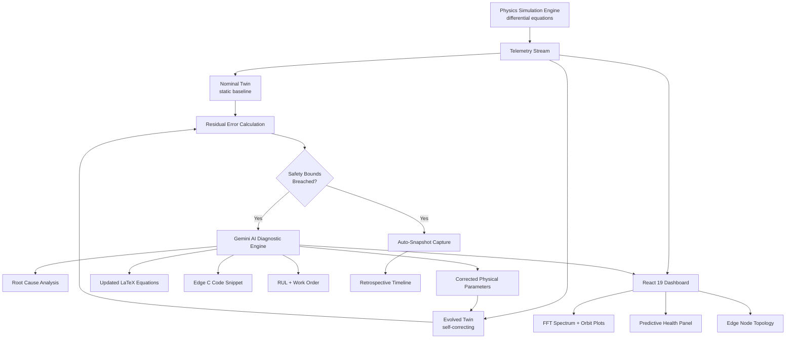

<div align="center">

# ⚙️ Edge Digital Twin Engine

### Self-Evolving Digital Twins for Industrial Machinery

**Physics-based simulation. AI-driven diagnosis. A twin model that learns from reality — in real time.**

[](https://edge-digital-twin-engine-ai-1.onrender.com)
[](https://react.dev)
[](https://www.typescriptlang.org)
[](https://ai.google.dev)
[](LICENSE)

<br/>

### 🔗 [**⚡ LAUNCH THE LIVE PLATFORM ⚡**](https://edge-digital-twin-engine-ai-1.onrender.com)

**`https://edge-digital-twin-engine-ai-1.onrender.com`**

<br/>

</div>

---

## 🌌 What Is This?

Most "digital twins" are static — a 3D model that mirrors a machine's shape but not its *behavior*. When the real machine wears, drifts, or degrades, the twin doesn't know. It just gets wrong.

**Edge Digital Twin Engine** builds something different: a twin governed by real physics differential equations, running side-by-side against a simulated physical sensor stream — and when the twin's predictions start to diverge from reality, an **AI diagnostic engine steps in, root-causes the fault, and evolves the twin's own physical parameters** so it converges back to truth. No human retrains it. It retrains itself.

Think of it as watching a machine's *digital shadow* slowly become smarter than a static spec sheet — because it's constantly being corrected by an AI that understands vibration signatures, thermal drift, and bearing failure modes.

```
Physical Machine  ──sensors──▶  Physical Twin Model (static)
                                        │
                                   residual error
                                        ▼
                              AI Diagnostic Engine (Gemini)
                                        │
                              root cause + new equations
                                        ▼
                          Evolved Twin Model (self-correcting) ──▶ converges
```

---

## 🏭 Machinery Library

Four industrial asset classes ship out of the box, each with full component breakdowns and real physical parameter defaults:

| Machinery | Category | Power | Modeled Components |
|---|---|:--:|---|
| 🌊 **High-Pressure Centrifugal Water Pump** | Fluid Handling & Processing | 110 kW | 316L Impeller · SKF Bearing · Mechanical Seal · IE4 Motor |
| 🔩 **5-Axis CNC Milling Spindle** | Precision Manufacturing | 35 kW | Ceramic Bearings · HSK Tool Clamp · Stator Cooling · Optical Encoder |
| ✈️ **Industrial Gas Turbine Generator** | Energy & Power Generation | 15 MW | Axial Compressor · DLE Combustor · Journal Bearing · Turbine Rotor |
| ⛏️ **Mining Planetary Conveyor Drive** | Heavy Material Handling | 250 kW | Sun Gear · Planet Carrier · Fluid Coupling · Output Shaft |

---

## ✨ Core Capabilities

### 🌀 Live Physics Simulation Engine
A continuous differential-equation solver models rotordynamics in real time — damping, bearing clearance, friction, thermal dissipation, shaft alignment, unbalance mass, and rotor stiffness — generating physically plausible vibration and thermal telemetry every tick.

### 🧬 Self-Evolving Twin Model
Two twin models run in parallel against the physical stream: a **static nominal twin** (frozen at commissioning) and an **evolved twin** (continuously corrected). Their divergence — the residual error — is the signal that drives evolution.

### 🩺 AI Root-Cause Diagnostics
When safety bounds are breached, Gemini analyzes recent telemetry, FFT spectrum peaks, and current physical parameters to return:
- A plain-language **diagnostic summary** and **root-cause analysis**
- The **detected fault type** — unbalance, bearing outer-race defect, shaft misalignment, lubrication degradation, cavitation, or thermal runaway
- **Corrected physical parameters** with an estimated new **fit-accuracy score**
- **Remaining Useful Life (RUL)** in hours and a maintenance urgency level

### 📐 Live Equation & Edge-Code Generation
Every evolution cycle produces updated governing equations in **LaTeX** and a ready-to-deploy **C code snippet** — so the corrected physics model can be pushed straight to an edge controller, not just viewed on a dashboard.

### 📊 Signal-Processing Visualization
- **FFT vibration spectrum** with harmonic labeling (1X RPM, 2X RPM, BPFO, etc.)
- **Shaft orbit plots** (X–Y displacement) for rotordynamic fault visualization
- Time-series charts comparing physical, nominal-twin, and evolved-twin readings side by side

### 🚨 Anomaly Injection Lab
Inject controlled faults — unbalance, bearing defects, misalignment, lubrication loss, cavitation, thermal runaway — with adjustable severity and rate-of-change, to watch detection and self-evolution happen live.

### 📸 Snapshot & Retrospective System
Safety-bounds breaches automatically capture a full **twin snapshot**: breached metrics, severity, component health, telemetry, and twin state at that instant — reviewable later in a retrospective timeline.

### 🩹 Predictive Health & Component Panel
Per-component health scoring (optimal → warning → degraded → critical) with live temperature and vibration RMS, so degradation is visible at the sub-assembly level, not just the machine level.

### 🗺️ Edge Node Topology View
A visual map of the simulated edge deployment — where the twin logic would physically run relative to the machinery it's modeling.

---

## 🏗️ Architecture



**Cycle:** physics engine ticks → telemetry compared across nominal vs evolved twin → residual error checked against safety bounds → breach triggers snapshot + AI diagnosis → AI returns corrected parameters and new equations → evolved twin updates → fit accuracy improves → cycle repeats.

---

## 🧰 Tech Stack

| Layer | Technology |
|---|---|
| **Frontend** | React 19, TypeScript, Vite 6, Tailwind CSS 4 |
| **Visualization** | Recharts (telemetry, FFT, orbit plots), Lucide React icons, Motion |
| **Backend** | Node.js, Express 4, TypeScript (`tsx` / `esbuild`) |
| **AI Diagnostics** | Google Gemini via `@google/genai` |
| **Simulation Core** | Custom physics engine — continuous-time rotordynamics ODE solver |
| **Deployment** | Render (Node web service) |

---

## 🚀 Getting Started

### Prerequisites
- **Node.js 18+**
- A **Google Gemini API key** — [get one here](https://aistudio.google.com/apikey)

### Installation

```bash
# 1. Clone the repository
git clone https://github.com/sathi2305/Edge-Digital-Twin-Engine-AI.git
cd Edge-Digital-Twin-Engine-AI

# 2. Install dependencies
npm install

# 3. Configure environment
cp .env.example .env
# add your Gemini key to .env

# 4. Start the dev server
npm run dev
```

The app runs at **http://localhost:3000**

### Environment Variables

```env
GEMINI_API_KEY="your_gemini_api_key"
APP_URL="http://localhost:3000"
```

> 🔐 `.env` is gitignored — never commit API keys. Rotate immediately if one is ever exposed.

### Available Scripts

| Command | Description |
|---|---|
| `npm run dev` | Dev server with Vite middleware + HMR |
| `npm run build` | Build client (Vite) and bundle server (esbuild) |
| `npm start` | Run the production build |
| `npm run lint` | Type-check with `tsc --noEmit` |
| `npm run clean` | Remove build artifacts |

---

## 🔌 API Reference

**Base URL:** `https://edge-digital-twin-engine-ai-1.onrender.com/api`

| Method | Endpoint | Description |
|---|---|---|
| `GET` | `/health` | Service status check |
| `POST` | `/evolve-twin` | Send machinery state, anomaly config, recent telemetry, and FFT peaks — receive AI root-cause diagnosis, corrected physical parameters, updated equations, edge code, and a maintenance work order |

**Example request body for `/evolve-twin`:**
```json
{
  "machineryType": "centrifugal_pump",
  "machineryName": "High-Pressure Centrifugal Water Pump",
  "currentTwinState": { "version": "1.0.0", "generation": 0, "fitAccuracy": 98.4, "params": { "...": "..." } },
  "anomalyConfig": { "type": "bearing_outer_race", "severity": 62, "rateOfChange": 1.0 },
  "recentTelemetry": [ "...telemetry points..." ],
  "fftPeaks": [ { "freq": 118.4, "mag": 0.42, "label": "BPFO" } ],
  "currentParams": { "...": "..." }
}
```

---

## 🗂️ Project Structure

```
Edge-Digital-Twin-Engine-AI/
├── server.ts                          # Express API + Gemini diagnostic engine
├── vite.config.ts                     # Vite + React + Tailwind config
├── index.html                         # App shell
├── .env.example                       # Environment template
└── src/
    ├── main.tsx                       # React entry point
    ├── App.tsx                        # Root state, simulation loop
    ├── types.ts                       # Physics, twin, and AI response types
    ├── data/machinerySpecs.ts         # 4 machinery profiles + components
    ├── services/physicsEngine.ts      # Rotordynamics ODE simulation core
    ├── utils/safetyMonitor.ts         # Bounds checking + snapshot capture
    └── components/
        ├── Header.tsx                 # Machinery selector & global controls
        ├── MachineryCanvas.tsx        # Live machine visualization
        ├── TelemetryCharts.tsx        # Physical vs twin time-series charts
        ├── TwinEvolutionPanel.tsx     # Evolution history & equation diffs
        ├── AnomalyInjector.tsx        # Fault injection console
        ├── PredictiveHealthPanel.tsx  # Component health + RUL
        ├── EdgeNodeTopology.tsx       # Edge deployment map
        ├── SnapshotNotificationToast.tsx
        └── SnapshotRetrospectiveModal.tsx
```

---

## ☁️ Deployment

Deployed on **Render** as a Node web service.

| Setting | Value |
|---|---|
| **Environment** | Node |
| **Build Command** | `npm install && npm run build` |
| **Start Command** | `npm start` |
| **Environment Variables** | `GEMINI_API_KEY` (secret), `NODE_ENV=production` |

**Live URL:** https://edge-digital-twin-engine-ai-1.onrender.com

> 💤 Free Render instances sleep when idle — the first request after inactivity may take 30–60 seconds to wake the service.

---

## 🗺️ Roadmap

- [ ] Real sensor ingestion (MQTT / OPC-UA) replacing simulated telemetry
- [ ] Persistent twin-state history in a time-series database
- [ ] Multi-asset fleet view for monitoring many machines at once
- [ ] Exportable maintenance work orders (PDF / CMMS integration)
- [ ] Additional machinery templates (compressors, transformers, wind turbines)
- [ ] WebSocket streaming to replace polling-based telemetry updates
- [ ] Automated edge-code deployment pipeline to physical PLCs

---

## 🤝 Contributing

```bash
git checkout -b feature/your-feature-name
git commit -m "Add: clear description of your change"
git push origin feature/your-feature-name
# Open a Pull Request
```

Run `npm run lint` before submitting. When adding a new machinery type, include full component definitions, default physical parameters, and safety bounds.

---

## 📄 License

Distributed under the MIT License. See [`LICENSE`](LICENSE) for details.

---

## 👤 Author

**Sathiyamoorthi**

[](https://github.com/sathi2305)

---

<div align="center">

### ⭐ If this project sparks an idea, consider starring the repository.

**[⚙️ Try the Live Platform](https://edge-digital-twin-engine-ai-1.onrender.com)**

*A twin that learns is a twin worth trusting.*

</div>
